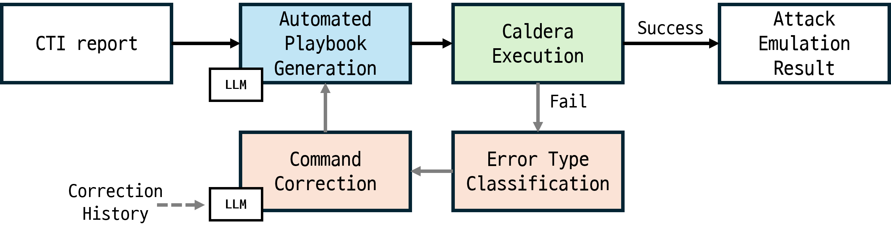
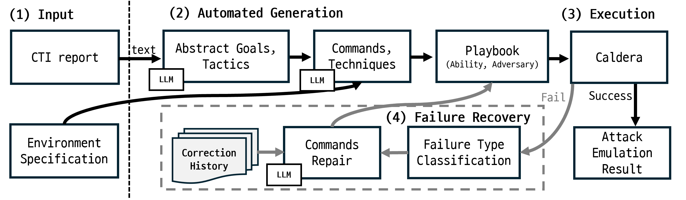
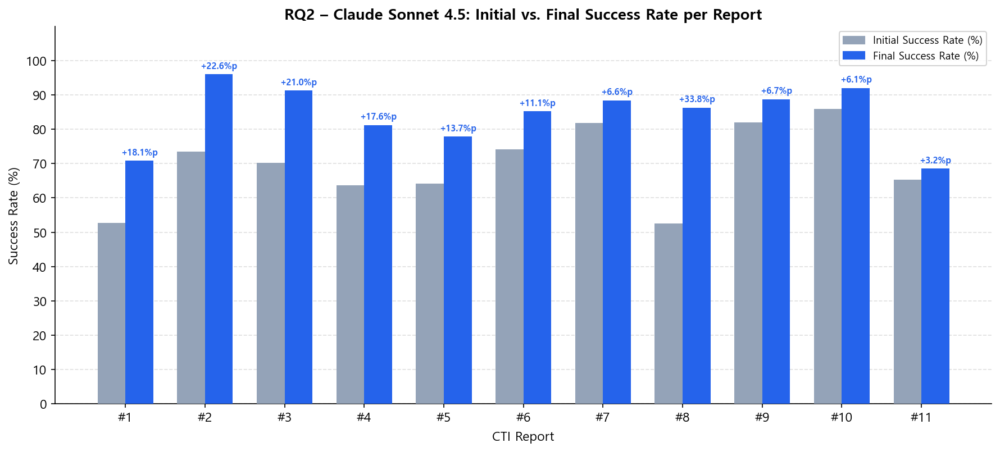

<h1 style="font-size: 1.6em; line-height: 1.4; font-weight: bold;">
Automatic End-to-End Adversary Emulation with 
Self-Correction from Cyber Threat Intelligence Using LLM
</h1>

  <a href="#">Author 1</a>1&nbsp;&nbsp;
  <a href="#">Author 2</a>1&nbsp;&nbsp;
  <a href="#">Author 3</a>1&nbsp;&nbsp;
  <a href="#">Author 4</a>1,2&nbsp;&nbsp;
  <a href="#">Author 5</a>2

  1 Institution 1 &nbsp;&nbsp;
  2 Institution 2

  <a href="https://github.com/alpakalee/testcaldera" style="display: inline-block; margin: 0 0.3em; padding: 0.45em 1.1em; background: #24292e; color: white; border-radius: 5px; text-decoration: none; font-size: 0.95em;">💻 Code</a>

---

## System Overview

---

## CTI Reports

11 KISA Cyber Threat Intelligence reports (2020–2024) used for evaluation.

| ID | Title | Link |
|----|-------|------|
| TTPs#1 | Homepage-based Internal Network Compromise | [KISA](https://www.boho.or.kr/kr/bbs/view.do?searchCnd=1&bbsId=B0000127&searchWrd=&menuNo=205021&pageIndex=1&categoryCode=&nttId=35330) |
| TTPs#2 | Spear Phishing Information Collection Campaign | [KISA](https://www.boho.or.kr/kr/bbs/view.do?searchCnd=1&bbsId=B0000127&searchWrd=&menuNo=205021&pageIndex=1&categoryCode=&nttId=35331) |
| TTPs#3 | Malware-based Multi-stage Intrusion | [KISA](https://www.boho.or.kr/kr/bbs/view.do?searchCnd=1&bbsId=B0000127&searchWrd=&menuNo=205021&pageIndex=1&categoryCode=&nttId=36601) |
| TTPs#4 | Phishing Target Reconnaissance | [KISA](https://www.boho.or.kr/kr/bbs/view.do?searchCnd=1&bbsId=B0000127&searchWrd=&menuNo=205021&pageIndex=1&categoryCode=&nttId=36602) |
| TTPs#5 | AD Environment Attack Patterns | [KISA](https://www.boho.or.kr/kr/bbs/view.do?searchCnd=1&bbsId=B0000127&searchWrd=&menuNo=205021&pageIndex=1&categoryCode=&nttId=36603) |
| TTPs#6 | Targeted Watering Hole Attack | [KISA](https://www.boho.or.kr/kr/bbs/view.do?searchCnd=1&bbsId=B0000127&searchWrd=&menuNo=205021&pageIndex=1&categoryCode=&nttId=36604) |
| TTPs#7 | SMB Admin Share Lateral Movement | [KISA](https://www.boho.or.kr/kr/bbs/view.do?searchCnd=1&bbsId=B0000127&searchWrd=&menuNo=205021&pageIndex=1&categoryCode=&nttId=36605) |
| TTPs#8 | Operation GWISIN – Targeted Ransomware | [KISA](https://www.boho.or.kr/kr/bbs/view.do?searchCnd=1&bbsId=B0000127&searchWrd=&menuNo=205021&pageIndex=1&categoryCode=&nttId=36606) |
| TTPs#9 | Personal Surveillance Attack Strategy | [KISA](https://www.boho.or.kr/kr/bbs/view.do?searchCnd=1&bbsId=B0000127&searchWrd=&menuNo=205021&pageIndex=1&categoryCode=&nttId=36607) |
| TTPs#10 | Operation GoldGoblin – Zero-day Intrusion | [KISA](https://www.boho.or.kr/kr/bbs/view.do?searchCnd=1&bbsId=B0000127&searchWrd=&menuNo=205021&pageIndex=1&categoryCode=&nttId=36608) |
| TTPs#11 | Operation An Octopus – Management Solution Attack | [KISA](https://www.boho.or.kr/kr/bbs/view.do?searchCnd=1&bbsId=B0000127&searchWrd=&menuNo=205021&pageIndex=1&categoryCode=&nttId=36609) |

---

## Results

11 reports × 4 LLMs × 5 runs = **220 experiments**.

### RQ1 — Efficiency (Claude Sonnet 4.5)

| Metric | Value |
|--------|-------|
| Avg. abilities per scenario | **27.3** |
| Avg. generation time | **2.8 min** |
| Avg. API cost per scenario | **$0.35** |

### RQ2 — Execution Success Rate & Self-Correction

| Model | Initial SR | Final SR | Improvement |
|-------|-----------|---------|------------|
| Claude Sonnet 4.5 | 69.63% | 84.22% | **+14.59 pp** |
| GPT-4o | 56.33% | 73.56% | **+17.23 pp** |
| Gemini 2.5 Pro | 71.37% | 87.86% | **+16.50 pp** |
| Grok 4 Fast | 58.44% | 73.96% | **+15.52 pp** |

### RQ3 — ATT&CK Fidelity

| Metric | Value |
|--------|-------|
| ATT&CK Validity | **94.91%** |
| CTI Precision | 73.97% |
| CTI Recall | 52.56% |
| CTI F1-score | **61.45%** |

### RQ4 — Security & Final Attack Goal

| Metric | Value |
|--------|-------|
| Security checklist pass rate | 91.11% |
| Final attack goals achieved | **11 / 11 (100%)** |

---

This project is licensed under the <a href="https://github.com/alpakalee/testcaldera/blob/main/LICENSE">MIT License</a>.
For educational and authorized security research purposes only.

